# 🎬 CineScope (KMP Edition)

CineScope is a **Kotlin Multiplatform (KMP)** application for discovering movies and exploring detailed information from TMDB.  
The project runs seamlessly on **Android, iOS, and Desktop**, sharing business logic across platforms while keeping native UI experiences.

---
## 📌 Development

The project’s active development and version control history were primarily managed on **Bitbucket**.  
This GitHub repository contains a migrated version of the codebase for portfolio and showcase purposes,  
therefore the commit count here is lower than the actual development activity.

---
## 📸 Screenshots

<div style="display: flex; flex-direction: column; gap: 40px;">

  <!-- Android Section -->
  <div>
    <h2>🤖 Android</h2>
    <div style="display: flex; gap: 20px; flex-wrap: wrap;">
      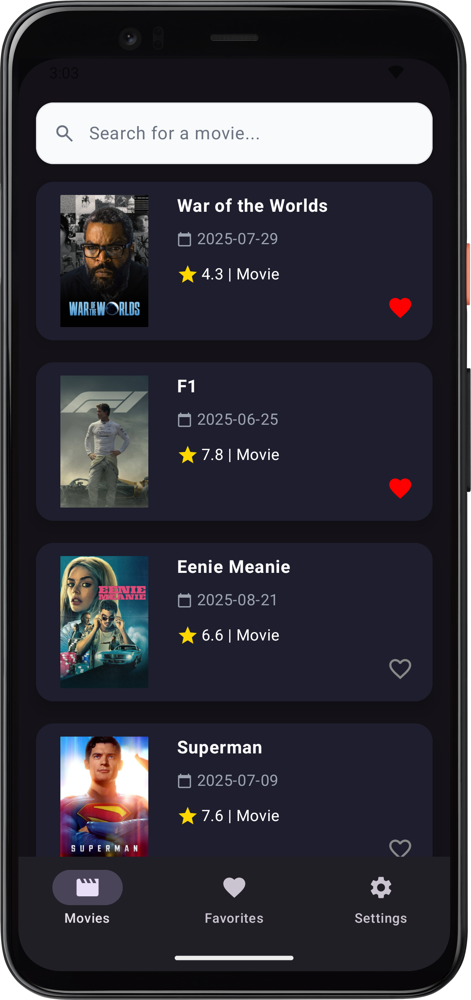
      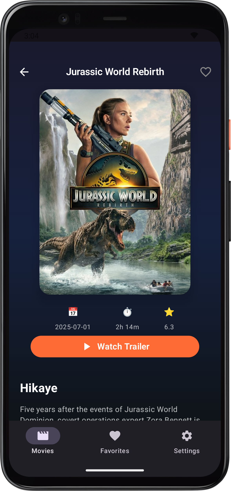
      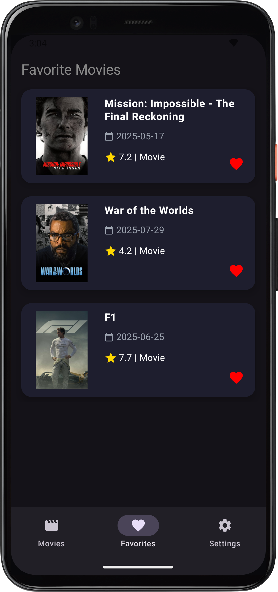
      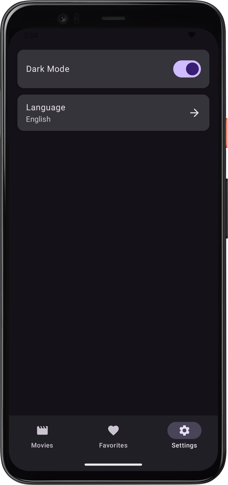

  </div>

  <!-- iOS Section -->
  <div>
    <h2> iOS</h2>
    <div style="display: flex; gap: 20px; flex-wrap: wrap;">
      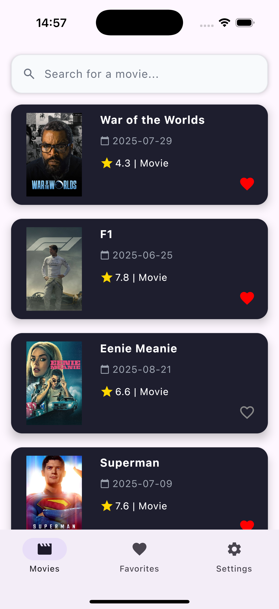
      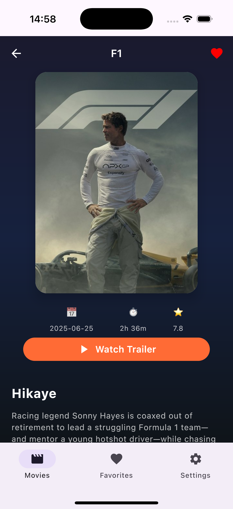
      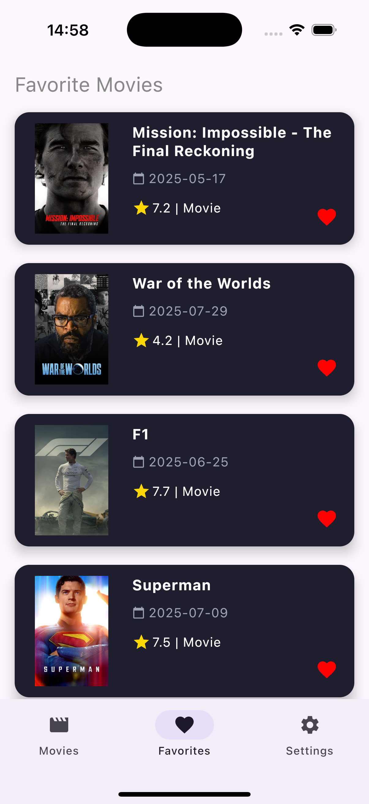
      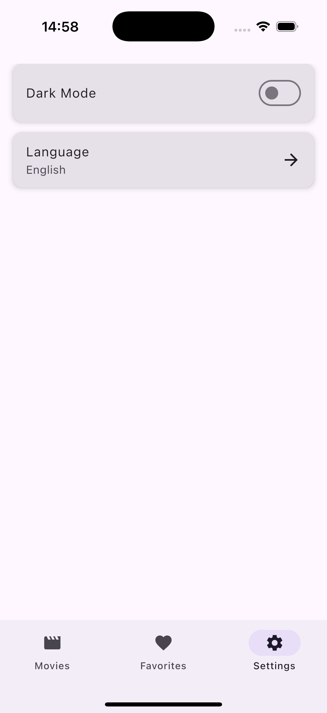

  </div>

  <!-- Desktop Section -->
  <div>
    <h2>🖥️ Desktop</h2>
    <div style="display: flex; gap: 20px; flex-wrap: wrap;">
      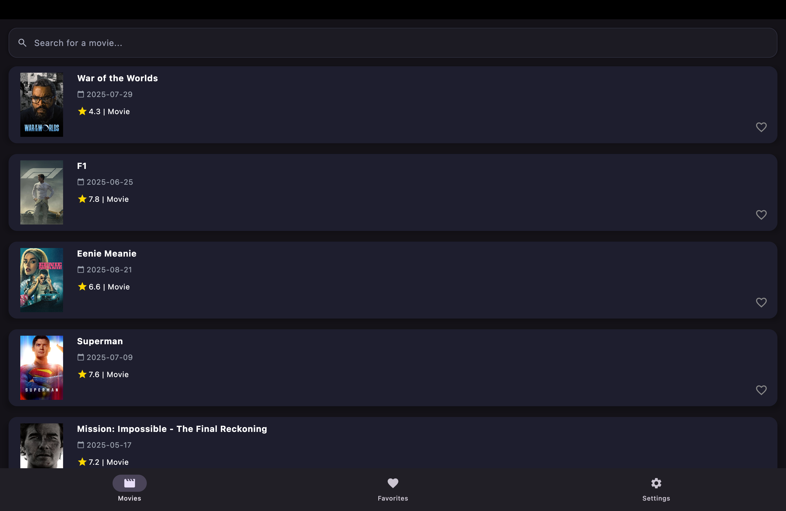
      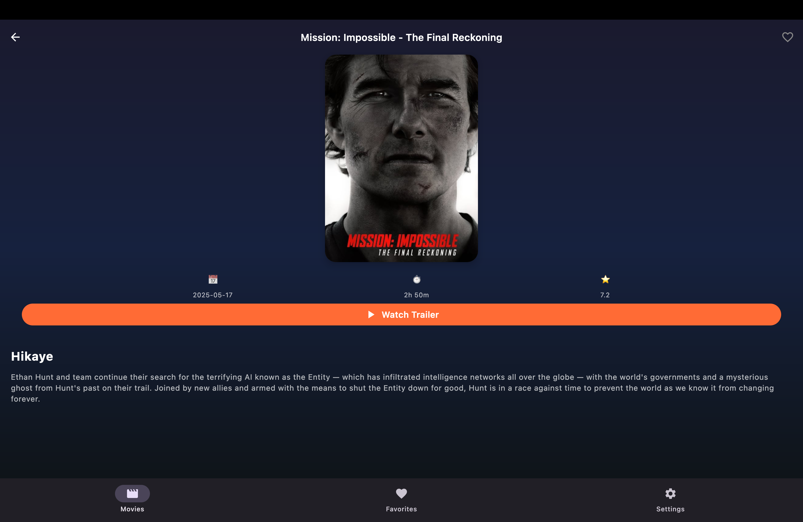
      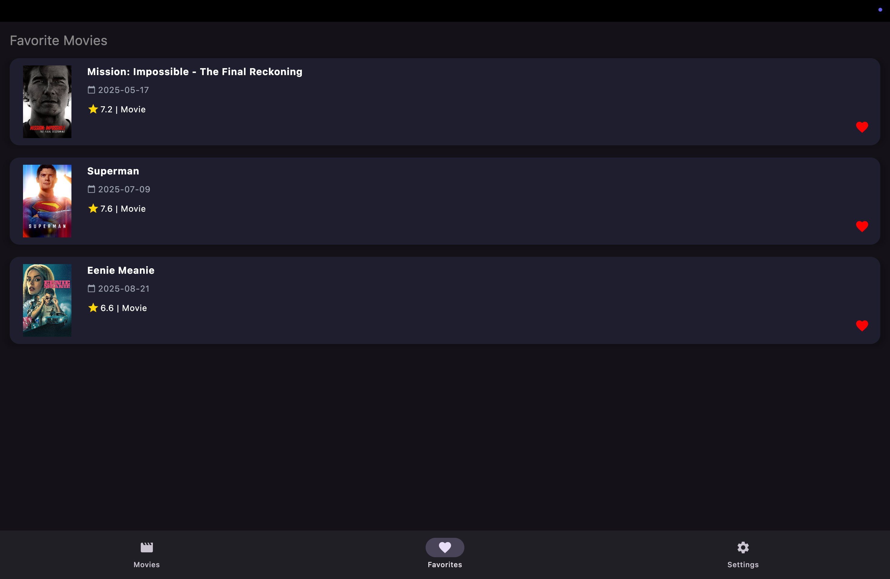
      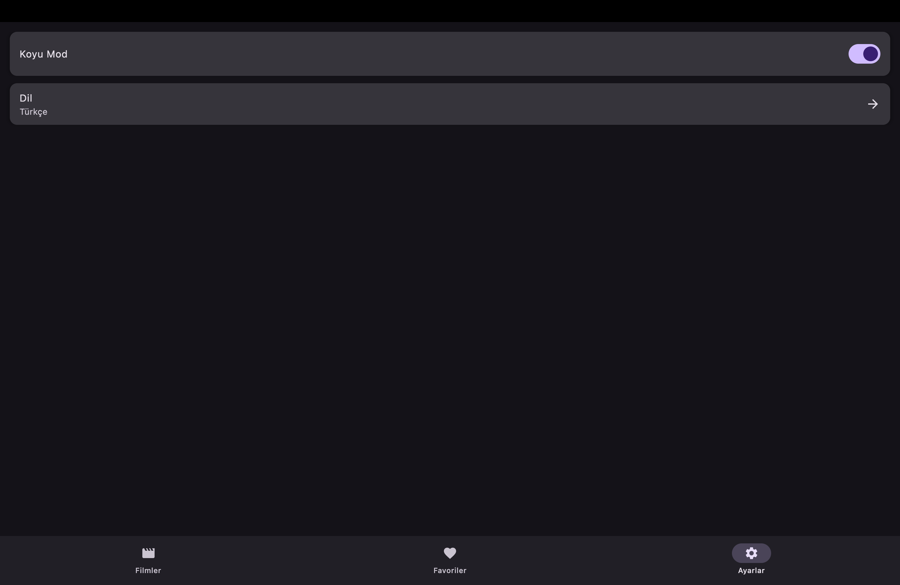

  </div>

</div>

## ✨ Features
- 🔍 Search for movies with detailed filters
- 📄 View movie details (overview, release date, rating, etc.)
- ⭐ Mark favorites for quick access
- 📱 Works across **Android, iOS, and Desktop**
- 🚀 Built with **Kotlin Multiplatform** for shared logic

---

## 🛠️ Tech Stack
- **Kotlin Multiplatform** (shared codebase)
- **Jetpack Compose Multiplatform** (UI for Android & Desktop)
- **SwiftUI** (UI for iOS)
- **Ktor Client** (networking)
- **SQLDelight** (local database)
- **Coroutines & Flow** (async & reactive programming)
- **MVVM + Clean Architecture** (scalable architecture)

---

## 🔑 TMDB API Key

This project uses the [TMDB API](https://www.themoviedb.org/documentation/api) for fetching movie data.  
To run the project, you need to add your TMDB API key in a `local.properties` file:

```properties
TMDB_API_KEY=your_api_key_here
